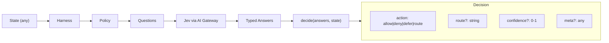

# jev-harness

**Agent decision harness** powered by [TypeSafe AI's Jev](https://typesafe.ai) via [Vercel AI Gateway](https://vercel.com/ai-gateway).

> Structured routing, scoring, and guardrails for AI agents—without parsing freeform JSON from an LLM.

## Why Not Just Ask an LLM?

LLM-as-judge approaches produce freeform JSON that's brittle to parse and validate. Jev provides **typed evaluation** via AI SDK's `experimental_evaluate`, returning structured answers to specific questions. This harness builds on that foundation with:

- **Named policies** with typed questions and decision logic
- **Predictable decisions**: `allow`, `deny`, `defer`, or `route` with confidence scores
- **Reusable helpers** for boolean, choice, score, and text questions
- **Testability**: Mock evaluators and fixtures for CI/CD

## Installation

```bash
pnpm add jev-harness ai
# or
npm install jev-harness ai
```

Set your API key:

```bash
export AI_GATEWAY_API_KEY=your_key_here
```

## Quick Start

```typescript
import { createHarness, storeReviewTriage } from 'jev-harness';

const harness = createHarness();
harness.register(storeReviewTriage);

const decision = await harness.evaluate(
  { text: 'App crashes on startup!', stars: 1 },
  'store-review-triage'
);

console.log(decision.route); // 'bug_ack'
console.log(decision.confidence); // 0.9
```

## Architecture



## Defining Policies

A policy has questions to ask and logic to decide:

```typescript
import {
  createPolicy,
  booleanQuestion,
  choiceQuestion,
  scoreQuestion,
  getBoolean,
  getChoice,
  getScore,
  route,
  defer,
} from 'jev-harness';

const ticketTriage = createPolicy({
  name: 'ticket-triage',
  description: 'Route support tickets to the right queue',
  questions: [
    choiceQuestion('category', 'What type of issue?', [
      'billing',
      'technical',
      'account',
      'other',
    ]),
    booleanQuestion('is_urgent', 'Is this time-sensitive?'),
    scoreQuestion('complexity', 'How complex? (0=simple, 1=very complex)'),
  ],
  decide: (answers, state) => {
    const category = getChoice(answers, 'category');
    const isUrgent = getBoolean(answers, 'is_urgent');
    const complexity = getScore(answers, 'complexity');

    if (isUrgent && complexity > 0.7) {
      return defer(answers, { confidence: 0.95 });
    }

    return route(answers, `${category}_queue`, {
      confidence: 1 - complexity,
    });
  },
});
```

## Built-in Policy: Store Review Triage

Analyze app store reviews and route to appropriate handlers:

```typescript
import { createHarness, storeReviewTriage } from 'jev-harness';
import type { StoreReviewState } from 'jev-harness';

const harness = createHarness();
harness.register(storeReviewTriage);

const review: StoreReviewState = {
  text: 'Great app but needs dark mode!',
  stars: 4,
};

const decision = await harness.evaluate(review, 'store-review-triage');
// decision.route: 'feature_note'
// decision.meta: { sentiment: 'positive', hasActionableFeedback: true }
```

**Routes:**
| Route | When |
|-------|------|
| `thanks` | Positive reviews with praise |
| `bug_ack` | Bug reports needing acknowledgment |
| `feature_note` | Feature requests to track |
| `skip` | Spam or low-priority content |
| `defer_human` | Billing, legal, or complex situations |

## Testing with Mocks

```typescript
import {
  createHarness,
  createMockEvaluate,
  storeReviewTriage,
} from 'jev-harness';

const mockAnswers = {
  sentiment: 'negative',
  is_bug_report: true,
  is_feature_request: false,
  contains_praise: false,
  needs_human: false,
  response_priority: 0.9,
  is_spam_or_irrelevant: false,
};

const harness = createHarness({
  evaluateFn: createMockEvaluate(mockAnswers),
});
harness.register(storeReviewTriage);

const decision = await harness.evaluate(
  { text: 'Crashes on launch' },
  'store-review-triage'
);

expect(decision.route).toBe('bug_ack');
```

## API Reference

### `createHarness(config?)`

Create a new harness instance.

```typescript
interface HarnessConfig {
  model?: string; // Default: 'typesafe-ai/jev'
  apiKey?: string; // Reads AI_GATEWAY_API_KEY by default
  baseURL?: string; // AI Gateway URL
  evaluateFn?: EvaluateFunction; // Custom evaluator for testing
}
```

### Decision Types

```typescript
interface Decision<TMeta = unknown> {
  action: 'allow' | 'deny' | 'defer' | 'route';
  route?: string;
  confidence?: number; // 0-1
  answers: Record<string, unknown>;
  meta?: TMeta;
}
```

### Question Helpers

```typescript
booleanQuestion(key, prompt); // yes/no
choiceQuestion(key, prompt, choices); // multiple choice
scoreQuestion(key, prompt, { min?, max? }); // numeric 0-1
textQuestion(key, prompt); // free text
```

### Answer Helpers

```typescript
getBoolean(answers, key); // boolean, defaults false
getChoice(answers, key); // string | undefined
getScore(answers, key); // number, defaults 0
getText(answers, key); // string, defaults ''
meetsThreshold(answers, key, threshold); // score >= threshold
```

### Decision Builders

```typescript
allow(answers, { confidence?, meta? });
deny(answers, { confidence?, meta? });
defer(answers, { confidence?, meta? });
route(answers, target, { confidence?, meta? });

// Fluent builder
decide(answers).routeTo('queue').confidence(0.9).meta({ x: 1 }).build();
```

## Example CLI

```bash
# Run with mock data
pnpm example

# Run with live Jev API
AI_GATEWAY_API_KEY=xxx pnpm example --live

# Evaluate a specific review
pnpm example --live --review "This app is amazing!"
```

## Configuration

| Variable | Description | Default |
|----------|-------------|---------|
| `AI_GATEWAY_API_KEY` | Vercel AI Gateway API key | Required for live calls |

## License

MIT © jev-harness contributors
