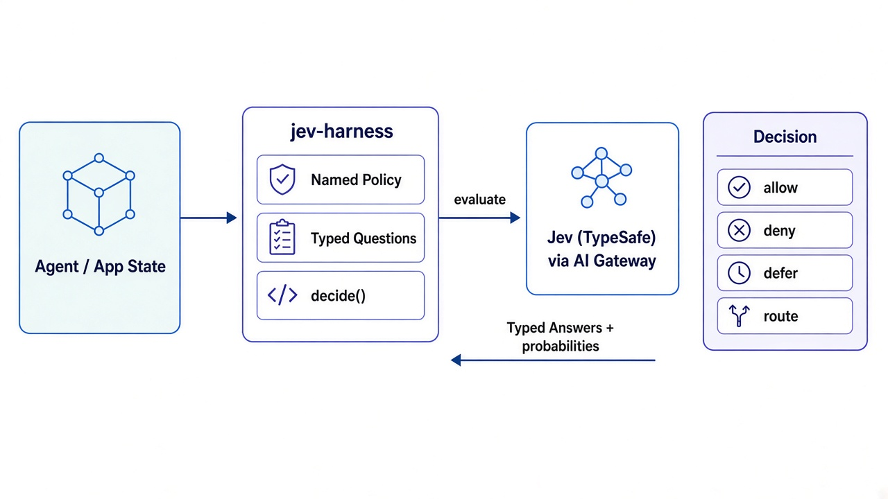
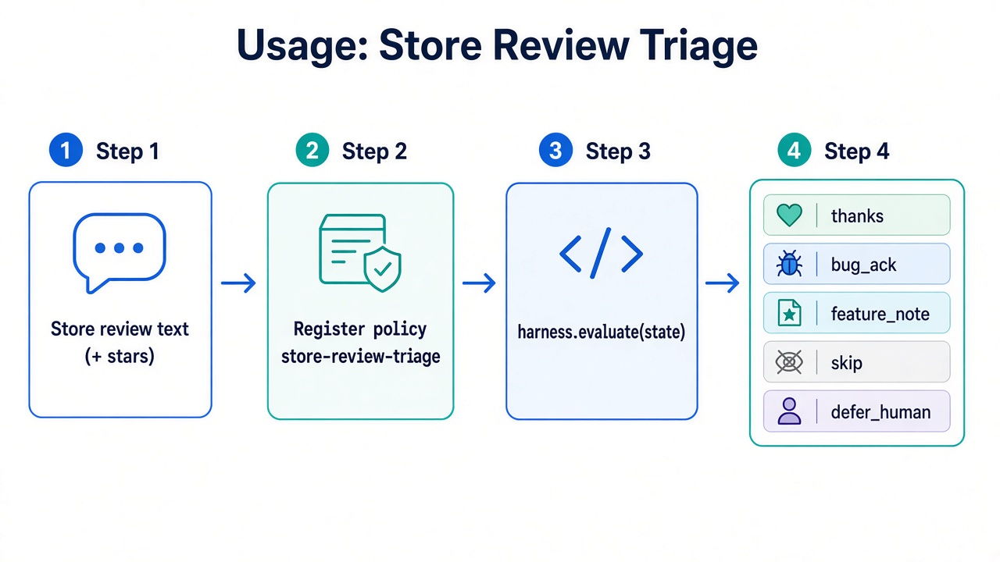

# jev-harness

Typed decision control plane for agents, powered by TypeSafe Jev.



## How It Works

Your agent or app passes state into **jev-harness**, which:
1. Matches a **named policy** to the context
2. Asks **typed questions** defined in that policy
3. Calls Jev (via AI Gateway) for evaluation
4. Returns a typed **decision** (`allow`, `deny`, `defer`, `route`) with probabilities

## Quick Start: Store Review Triage



```typescript
import { Harness } from "jev-harness";

const harness = new Harness({ policy: "store-review-triage" });

const decision = await harness.evaluate({
  review: "Love the app but it crashes on startup",
  stars: 4,
});

// decision.outcome: "thanks" | "bug_ack" | "feature_note" | "skip" | "defer_human"
```

## Installation

```bash
npm install jev-harness
```

## License

MIT
